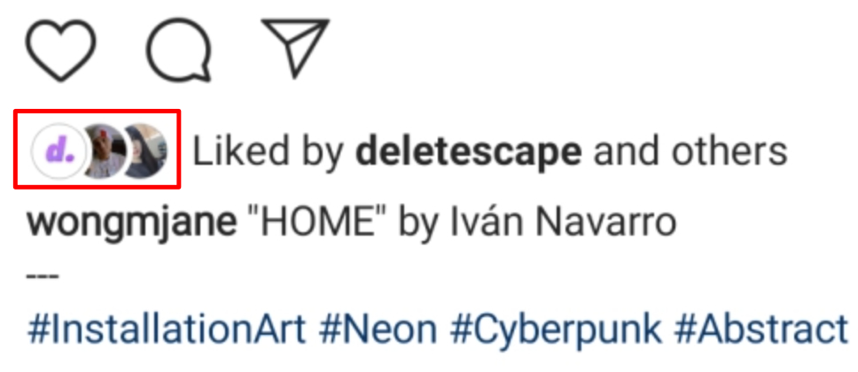
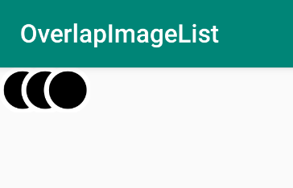
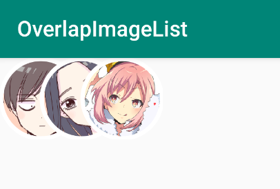

# OverlapImageListView
[](https://jitpack.io/#zend10/OverlapImageListView)

OverlapImageListView is a library project for Android to easily display overlapping image list like on Instagram.



## Installation
Add the JitPack repository to your **project** build file `build.gradle`:

```
allprojects {
    repositories {
        ...
        maven { url 'https://jitpack.io' }
    }
}
```

Add the dependency to your **app** build file `build.gradle`:

```
dependencies {
    implementation 'com.github.zend10:OverlapImageListView:v1.0.0'
}
```

## Usage
The usage is very straightforward, simply by adding it through xml:

```xml
<com.zen.overlapimagelistview.OverlapImageListView
        android:id="@+id/overlapImage"
        app:fillColor="#000000"
        app:strokeWidth="4dp"
        app:strokeColor="#FFFFFF"
        app:circleCount="3"
        android:layout_width="wrap_content"
        android:layout_height="36dp"/>
```

Result:




## Customisation
There are four supported attributes that can be modified through xml:
- `fillColor`: Set the color of the circle
- `strokeColor`: Set the color of the stroke/border
- `strokeWidth`: Set the width of the stroke/border (minimum: `2F`, maximum: `circle size / 3`)
- `circleCount`: Set the amount of circle to display (minimum: `1`, maximum: `50`)

Example usage of these attributes is as shown at the example above.

There are three additional properties that can only modified through the code:
- `size`: Set the diameter of the circle, this size value can be overwritten if the layout this view resides in is too small.
- `image`: Display image inside the circle.
- `imageList`: Give multiple images that should be displayed in the circle in turn.

Example usage of these properties, notice the `android:layout_height` is set as `wrap_content`, unlike the example above. The size of the circles will be set through property `size` later:
```xml
<com.zen.overlapimagelistview.OverlapImageListView
        android:id="@+id/overlapImage"
        app:fillColor="#000000"
        app:strokeWidth="4dp"
        app:strokeColor="#FFFFFF"
        app:circleCount="3"
        android:layout_width="wrap_content"
        android:layout_height="wrap_content"/>
```

The size of the circle can be modified simply by setting the `size` property in your kotlin code:
```kotlin
overlapImage.size = 200F
```

To supply multiple images to the circles, use `imageList` property:
```kotlin
val imageList = ArrayList<Bitmap>()

val imageResourceList = ArrayList<Int>()
imageResourceList.add(R.drawable.yuya)
imageResourceList.add(R.drawable.rio)
imageResourceList.add(R.drawable.yoshino)

imageResourceList.forEach {
    // any good image processing library that can convert to bitmap is fine
    Glide.with(this).asBitmap().load(it).apply(RequestOptions.circleCropTransform())
        .into(object : CustomTarget<Bitmap>() {
            override fun onResourceReady(
                resource: Bitmap,
                transition: Transition<in Bitmap>?
            ) {
                imageList.add(resource)

                // set the image after everything is loaded
                if (imageList.size == imageResourceList.size) {
                    overlapImage.imageList = imageList
                }
            }

            override fun onLoadCleared(placeholder: Drawable?) { }
        })
}
```

Result:


